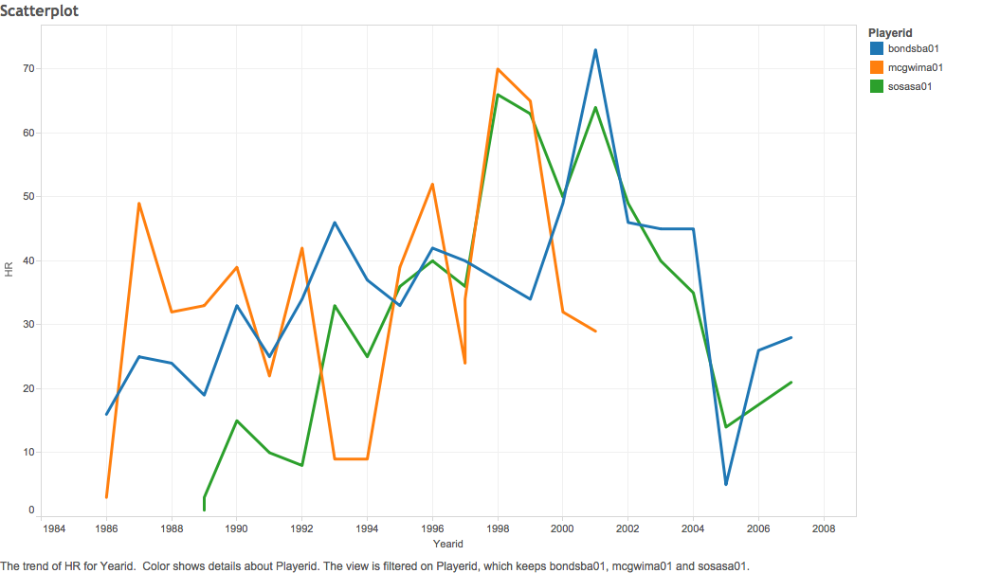

---
Batting Statistics Visualization
===

In this document, I will explain the steps taken to create a graphical visualizaiton of batting statistics from 1985-2015.


###ScatterPlot
One of the most historic period in baseball was the HR battles of the late 90s. Year after year three players: Barry Bonds, Mark McGwire, and Sammy Sosa alternatively set and broke the single season HR record. Culminating in 2001 with Barry Bonds hitting 73, a record which still stands today. This scatter plot charts the home runs per season by these three players



```{r}
source("../01 Data/scatterplot.R", echo = TRUE)
```


###Bar chart

Our Bar Chart shows how many at bats, on average, each team in the MLB has between hitting homeruns. This bar chart shows which teams historically have been better at hitting home runs due to: ballpark construction, weather conditions, and hitting talent.


```{r}
source("../01 Data/barchart.R", echo = TRUE)
```

###Blended data
In this graph, we blended the data for baseball batting and salary stats. Our visualization shows on base percentage, a metric used to determine a players offensive capabilities, and player salaries. As you can see, there is a correlation between salary and obp. There are also many outliers. Some of the highest paid players have very low on base percentages. Those players are pitchers. They get paid for the pithcing ability and not ther offensive capabilities.


###Cross Tab
Our cross tab shows each players average per season on base percentage for the Texas rangers. On base percentage is a KPI we created that demonstrates how effective a player is at getting on base. To create the on base percentage we used this formula (Hits + walks + times hit by pitch) / (At bats + walks + times hit by pitch + sacrifice flies). OBP is a good indicator of how a players offensive capabilities


```{r}
source("../01 Data/crosstab.R", echo = TRUE)
```
